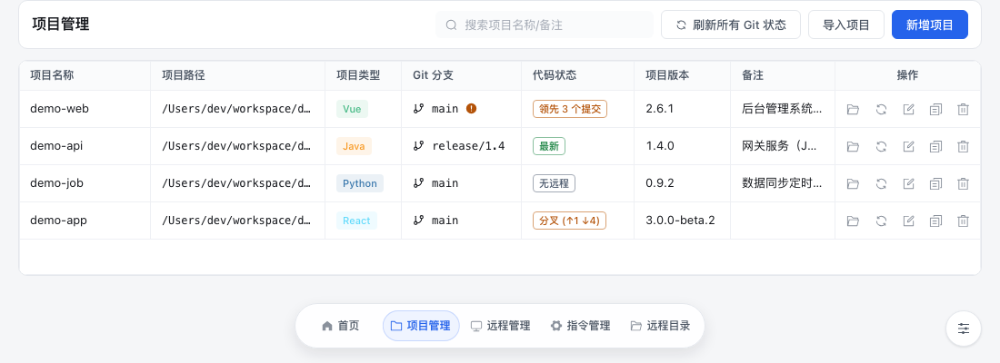
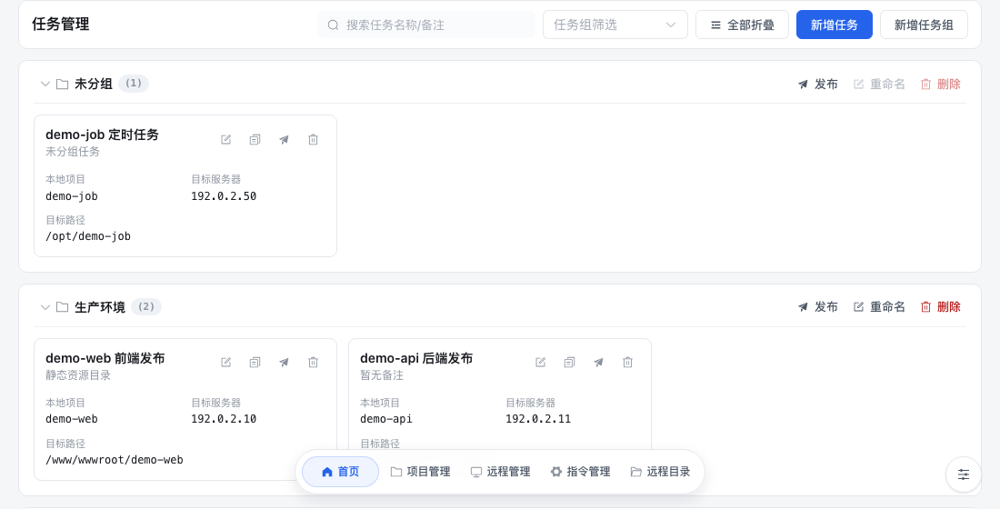
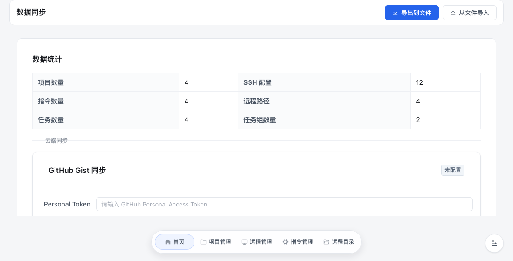
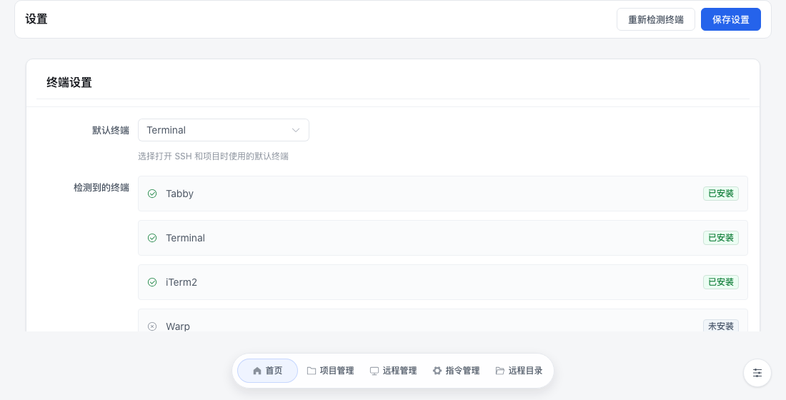

<div align="center">

# ZR-Publish

**把本地文件发布到远程服务器 —— 面向没有 Jenkins / CI-CD 的轻量发布场景**

[](LICENSE) [](https://www.u-tools.cn/) [](https://vuejs.org/) [](https://vite.dev/) [](https://element-plus.org/)

</div>

## 目录

- [这是什么](#这是什么)
- [功能特性](#功能特性)
- [界面预览](#界面预览)
- [安装](#安装)
- [快速上手](#快速上手)
- [开发](#开发)
- [打包与发布](#打包与发布)
- [数据与备份](#数据与备份)
- [安全说明](#安全说明)
- [常见问题](#常见问题)
- [参与开发](#参与开发)
- [许可证](#许可证)

## 这是什么

ZR-Publish 是一个 [uTools](https://www.u-tools.cn/) 插件应用：把本地项目目录或文件上传到远程服务器，并按需在上传后执行自定义命令。

主要用于**没有搭建 Jenkins、CI/CD 服务**的代码发布场景：

- 前端静态资源发布（构建产物目录 → Nginx 站点目录）
- 后端 jar 包 / 二进制上传，上传后重启服务
- 定时脚本、配置文件的多机同步发布

## 功能特性

| 模块 | 能力 |
| --- | --- |
| 项目管理 | 新增项目、选择父目录批量导入；自动识别项目类型（Vue / React / Vite / Node / Java / Python 等）与版本号；Git 状态只读展示（分支、领先 / 落后 / 分叉、未提交文件数），支持行内刷新与批量刷新 |
| SSH 管理 | 密码与私钥（含 passphrase）两种认证方式，支持连接测试；凭据加密后存入本地数据库 |
| 远程路径管理 | 维护常用部署路径，新建任务时直接选择 |
| 指令管理 | 维护常用命令（例如 `pm2 restart app`），任务中快速引用 |
| 任务 / 任务组 | 一个任务 = 本地路径 + 一台或多台服务器 + 目标路径 + 上传后执行命令；支持「排除删除」避免误删远端既有文件；任务组支持按组折叠与批量发布 |
| 发布日志 | 发布过程实时输出，右侧抽屉查看 |
| 多终端 | 一键在终端中打开项目或 SSH 连接，自动检测 Tabby、iTerm2、Terminal、Warp、Windows Terminal、PowerShell、gnome-terminal 等 |
| 数据同步 | 本地导出 / 导入 JSON 备份；也可通过 GitHub Gist、Gitee 代码片段做云端中转 |

## 界面预览

**项目管理** —— 路径、类型识别、Git 状态与操作按钮



**任务管理** —— 按任务组展示，卡片上可直接编辑 / 复制 / 发布 / 删除



**数据同步** —— 本地导出 / 导入，以及 GitHub、Gitee 云端同步



**设置** —— 终端检测与 Git 刷新策略



## 安装

### 从插件应用市场安装（推荐）

在 uTools 中搜索 `zr-publish`、`zr` 或 `代码发布`，进入插件应用详情页安装。

### 使用离线安装包（.upxs）

仓库 [`package/`](package) 目录下是已打包的离线安装包（例如 `zr-publish-2.0.0.upxs`）：

1. 双击 `.upxs` 文件；
2. uTools 会弹出安全提示，确认后即完成安装（离线包无需审核）。

> 离线包适合自用或内部分享；希望通过应用市场分发给更多人，请参考 [发布到应用市场](https://www.u-tools.cn/docs/developer/basic/publish-plugin.html)。
>
> `package/` 里是历史留档的离线包，可能落后于当前源码；需要最新版本请按[打包与发布](#打包与发布)自行构建，或从应用市场安装。

## 快速上手

1. **添加服务器** —— 「远程管理」→ 新增 SSH：填写名称、IP、端口、用户名，选择密码或私钥认证，可点「测试连接」确认能连通。
2. **添加项目** —— 「项目管理」→ 新增项目（或「导入项目」选择父目录批量导入）：填写名称与本地路径，项目类型与版本会自动识别。
3. **准备路径与命令（可选）** —— 「远程目录」维护常用部署路径，「指令管理」维护常用命令，之后新建任务时可直接选用。
4. **新建任务** —— 「首页」→ 新增任务：选择本地项目、勾选目标服务器（支持多选）、填写目标路径，按需填写上传后执行命令。
5. **发布** —— 点击任务卡片上的发布图标，右侧抽屉会实时输出日志；任务组可点击组标题右侧的「发布」批量发布该组全部任务。

> 建议首次发布先在任务里核对本地路径与远程路径，并利用「排除删除」面板避免误删服务器上的既有文件。

## 开发

### 环境要求

| 依赖    | 版本要求                                                               |
| ------- | ---------------------------------------------------------------------- |
| Node.js | `^20.19.0` 或 `>=22.12.0`（Vite 7 要求；本项目在 22.x 下开发）         |
| pnpm    | 仓库使用 `pnpm-lock.yaml`（开发时使用 pnpm 12 验证）                   |
| uTools  | 用于调试与打包（[开发者工具](https://www.u-tools.cn/docs/developer/)） |

### 安装依赖

渲染进程与 preload 是两套依赖，都需要安装：

```bash
pnpm install                      # 根目录：Vue / Vite / Element Plus 等

cd public/preload && npm install  # preload：node-ssh 及其原生依赖，供 uTools 加载
```

> `public/preload/` 使用 npm（该目录下是 `package-lock.json`）；其中的原生模块（`sshcrypto.node` 等）是分平台的，换平台后需要重新安装。

### 本地调试

```bash
pnpm dev     # 启动 Vite 开发服务器，默认 http://localhost:3020
```

然后在 uTools 中挂载开发环境：

1. 打开 **uTools 开发者工具** → 新建项目，选择本仓库目录（会读取 `public/plugin.json`）；
2. 点击「进入开发」，uTools 会加载 `plugin.json` 中 `development.main` 指向的地址，即上面的开发服务器；
3. 页面代码改动即时热更新；**preload 代码改动需要重新进入开发**才会生效。

> `public/plugin.json` 里的 `development.main` 已指向 `http://localhost:3020`，改端口时两处要一起改。

### 常用脚本

| 命令                                | 说明                               |
| ----------------------------------- | ---------------------------------- |
| `pnpm dev`                          | 启动开发服务器                     |
| `pnpm build`                        | 构建到 `dist/`（打包用）           |
| `pnpm typecheck`                    | `vue-tsc` 类型检查（当前 0 error） |
| `pnpm format` / `pnpm format:check` | Prettier 格式化 / 校验             |

### 目录结构

```
├── public/
│   ├── plugin.json           # uTools 插件配置：入口、指令、开发地址
│   ├── logo.png
│   └── preload/              # 预加载脚本：Node 侧能力（SSH、文件、终端、Git）
├── src/
│   ├── views/                # 页面：Home 任务 / Project 项目 / SSh 服务器 / Command 指令
│   │                         #      Remote 远程目录 / DataSync 数据同步 / Settings 设置 / Doc 文档
│   ├── components/           # 公共组件：列表页、各实体新增/编辑弹窗、图标
│   ├── DB/                   # uTools DB 读写封装，每个实体一个文档
│   ├── services/             # 发布队列管理、数据导入导出
│   ├── utils/                # 加解密、Git 异步队列、反馈提示、CHANGELOG 解析等
│   ├── types/                # 类型定义（含 uTools API 声明）
│   ├── assets/               # 样式与文档配图
│   └── main.css, index.scss  # 设计令牌与 Element Plus 主题
├── CHANGELOG.md              # 版本记录（插件内「版本历史」在构建时读取此文件）
└── package/                  # 已打包的离线安装包
```

## 打包与发布

1. `pnpm build` 生成 `dist/`；
2. 打开 **uTools 开发者工具 → 打包**，目录选择 `dist/`，填写版本号，保存得到 `.upxs`；
3. 可将离线包放入 `package/` 目录留档。

注意事项：

- **平台原生模块**：preload 依赖 `node-ssh` → `ssh2` 的原生模块，分平台编译。请在目标平台重新 `npm install` 后再打包，否则装到其他平台可能出现 SSH 连不上。
- 打包与发布需要**分别填写版本号**，两者并不关联，版本号遵循 semver 规范。
- 版本记录只维护 `CHANGELOG.md` 一处 —— 插件内「使用文档 → 版本历史」会在构建时读取它并渲染，不需要另外维护文档页。

## 数据与备份

所有数据存放在 uTools 的本地数据库（IndexedDB），每个实体一个文档：

| 文档                       | 内容                                       |
| -------------------------- | ------------------------------------------ |
| `zr-publish/project`       | 项目                                       |
| `zr-publish/ssh`           | 服务器与凭据（加密存储）                   |
| `zr-publish/task`          | 发布任务                                   |
| `zr-publish/task-group`    | 任务组                                     |
| `zr-publish/command`       | 常用命令                                   |
| `zr-publish/remote`        | 常用远程路径                               |
| `zr-publish/settings`      | 设置（默认终端、Git 自动刷新、折叠状态等） |
| `zr-publish/publish-state` | 发布队列状态（用于重启后收尾）             |

备份：「数据同步」→ 导出到文件生成 JSON（格式 `1.1`，凭据保持密文）；导入时整体覆盖，任一步失败会回滚到导入前的数据。

> 格式 `1.1` 的备份**不能用 2.0.0 及更早版本导入**（旧版本会把密文再加密一次导致口令不可用），请使用 2.1.0 及以上版本恢复。旧版本导出的明文备份仍可正常导入。

## 安全说明

- **命令执行**：本地命令全部通过 `execFileSync(cmd, [args])` 以参数数组方式调用，不经过 shell；远端命令的参数统一做单引号转义，分支名等外部输入不会被当作命令执行。
- **远端路径**：上传前校验为绝对路径、非根目录、不含 `..`，避免 `rm -rf ${path}` 这类误删远端目录的风险。
- **凭据存储**：SSH 密码与私钥口令使用 AES 加密后写入本地数据库，导出备份时同样保持密文。加密密钥内置在插件中，作用是**避免口令被直接看到**，并不构成对能够获取插件本体的攻击者的保护。
- **preload 暴露面**：只暴露渲染进程实际调用的接口，无人使用却可执行任意命令的方法已移除。
- **Git 只读**：pull / push / commit / 切换分支等操作刻意不提供，交给 IDE 或终端完成，避免在发布工具中误操作导致代码冲突。

如果你发现了安全问题，请通过下方「参与开发」中的联系方式私下反馈，而不是直接开公开 Issue。

## 常见问题

**Q：打开项目时提示 VS Code / IDEA 不可用？**

需要把 `code` / `idea` 命令加入 PATH：VS Code 可在命令面板执行 `Shell Command: Install 'code' command in PATH`；IDEA 可用 Toolbox 或手动创建软链。用不到这些编辑器时，也可以在「设置」里改用终端打开。

**Q：为什么 Git 状态只能看，不能 pull / push？**

见上方[安全说明](#安全说明)。插件只负责展示分支与领先 / 落后状态，Git 操作请在终端或 IDE 中进行，完成后回到插件点刷新图标更新状态。

**Q：终端打开失败 / 没有我用的终端？**

「设置」页会列出检测到的终端及是否可用，可指定默认终端；未检测到的终端可以手动填写自定义启动命令。

**Q：插件会请求外部网络吗？**

插件完全离线运行：字体使用系统字体栈，文档配图随包分发，不请求任何外部资源。只有你主动使用 GitHub Gist / Gitee 云端同步时才会访问对应服务。

**Q：发布一直卡在“发布中”？**

2.1.0 起，客户端超时后会等待底层任务真正结束再释放锁，不再出现后续发布全部失败。若仍异常，重启插件即可把残留队列收尾为「已中断」，然后重新发布。

**Q：换电脑后数据怎么办？**

见[数据与备份](#数据与备份)，通过「数据同步」导出 JSON，在新设备导入即可。

## 参与开发

- **提交信息**：使用中文 conventional commits（如 `fix(ssh): ...`、`feat(ui): ...`），一次提交只做一件事。
- **提交前**：请确保 `pnpm typecheck` 与 `pnpm build` 通过，并按需执行 `pnpm format`。
- **用户可见的改动**：请在 `CHANGELOG.md` 追加记录（插件内的版本历史会自动读取）。
- **仓库**：<https://github.com/jackbi/zr-publish>
- **反馈**：仓库 Issue，或见插件内「使用文档 → 反馈与支持」。

## 许可证

本项目基于 [MIT 许可证](LICENSE) 开源，版权归 wenbin 所有（Copyright © 2025 wenbin）。

你可以自由使用、修改、分发本项目（包括商用），只需保留版权声明与许可证文本；软件按“现状”提供，不附带任何担保。
